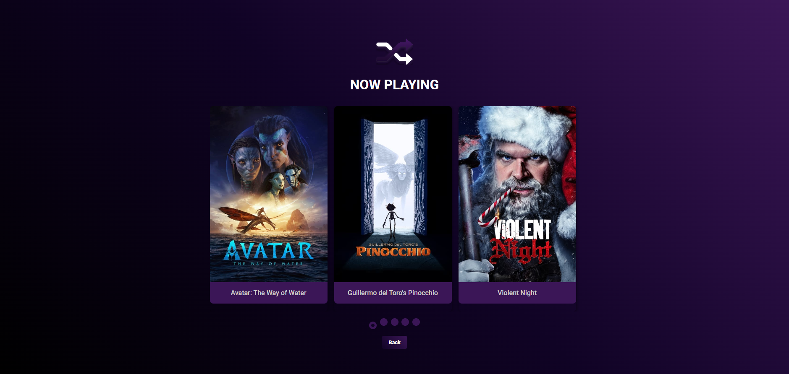
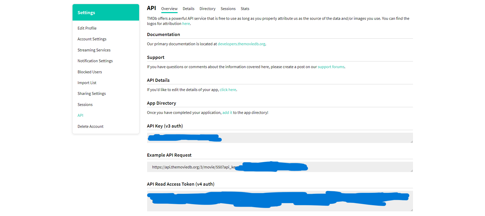

# MovieRandomizer

Movie randomizer page. It uses TheMovieDB (themoviedb.org) API to suggest random movies, displaying movie poster, description and trailer, when available.
It also can show a list of the most popular movies currently in the theaters. Built using HTML/CSS/Javascript.

Added Now Playing page:

## Instructions

-In order to run this project, you'll need to create an account on TMDB:
https://www.themoviedb.org/signup

-After verifying your email, request a developer API key:
https://www.themoviedb.org/settings/api/request

-After setting up your information, you should have access to the key:

-Now in the project, open the file "api.example", replace "YOUR_API_KEY" with the key you generated and rename the file to "api.js".

-That's it! (:
