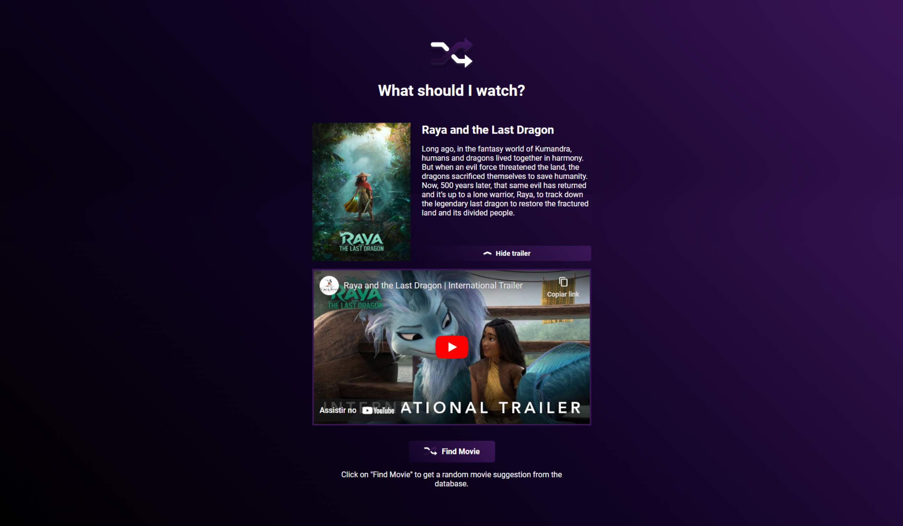

# MovieRandomizer
Movie randomizer page. It uses TheMovieDB API to suggest random movies, displaying movie poster, description and trailer, when available.
Also can show a list of the most popular movies currently in the theaters. Built using plain HTML/CSS/Javascript.

## Instructions

